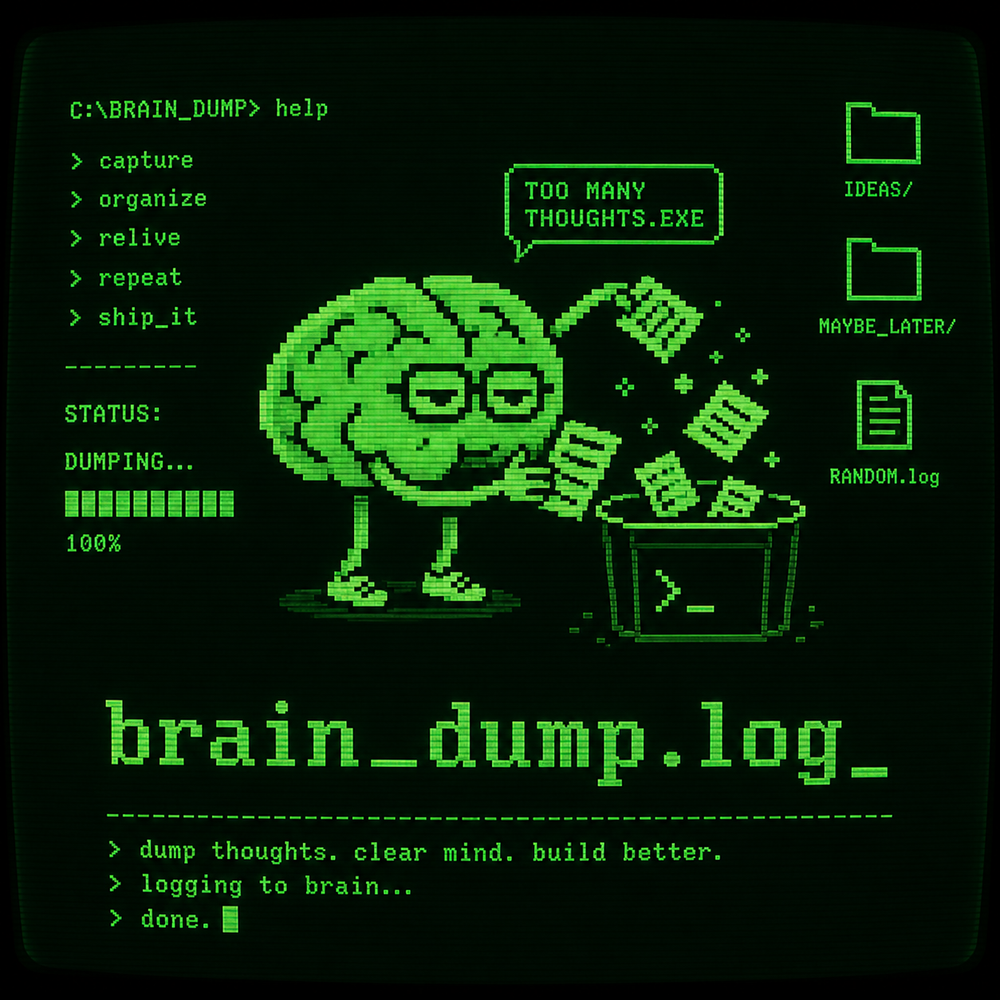

# Brain Dump



**Brain Dump** is a robust, offline-first note-taking application built with Flutter. It is designed for maximum speed and efficiency, allowing users to quickly capture messy thoughts, tasks, and ideas with a unique dual-theme interface.

## 🚀 Key Features

*   **Dual UI Themes:** Switch seamlessly between a clean, modern aesthetic and a nostalgic "Retro Hacker/Terminal" CRT-style interface.
*   **Offline-First:** Built on top of **Hive** NoSQL database for instant, offline, on-device storage. No loading spinners or splash screens.
*   **Rich Text Editing:** Full rich text support powered by `flutter_quill` (Bold, Italics, Headings, Lists).
*   **Biometric Security:** Lock individual sensitive notes behind device-level biometric authentication (FaceID/Fingerprint).
*   **Voice & Media:** Quickly dictate voice notes or capture photos directly inline with your text.
*   **Trash Management:** Safely move notes to the Trash with the ability to restore or permanently delete them later.

## 🛠 Tech Stack

*   **Framework:** [Flutter](https://flutter.dev/) (Dart)
*   **State Management:** `provider`
*   **Local Storage:** `hive` & `hive_flutter`
*   **Rich Text:** `flutter_quill`
*   **Security:** `local_auth`
*   **Media/Voice:** `image_picker`, `speech_to_text`

## 📦 Getting Started

### Prerequisites
*   Flutter SDK (Compatible with older/stable versions, utilizing `.withOpacity()` instead of newer alpha bindings).
*   Dart SDK

### Installation

1. Clone the repository or navigate to the project directory:
   ```bash
   cd flutter_application_1
   ```

2. Fetch the Flutter dependencies:
   ```bash
   flutter pub get
   ```

3. Run the application:
   ```bash
   flutter run
   ```

## 📝 Note on Folder Naming
While the display name of the application across all platforms (Android, iOS, Web, Windows, macOS, Linux) is configured to **Brain Dump**, the internal project folder and binary name remain `flutter_application_1`. 

---
*Developed with a focus on speed, privacy, and a premium aesthetic.*
